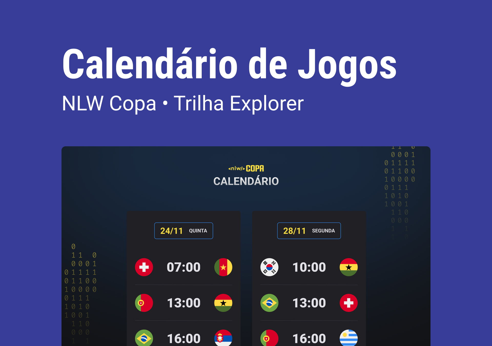

<h1 align="center"> Nlw 10 Copa </h1>

  <a href="#-tecnologias">Tecnologias</a>&nbsp;&nbsp;&nbsp;|&nbsp;&nbsp;&nbsp;
  <a href="#-projeto">Projeto</a>&nbsp;&nbsp;&nbsp;|&nbsp;&nbsp;&nbsp;
  <a href="#-layout">Layout</a>&nbsp;&nbsp;&nbsp;|&nbsp;&nbsp;&nbsp;
  <a href="#memo-licença">Licença</a>

  

 

  

## 🚀 Tecnologias

Esse projeto foi desenvolvido com as seguintes tecnologias:

- HTML e CSS
- JavaScript
- GIT e GITHUB

## 💻 Projeto

Calendário da Copa, é um projeto que mostra todos jogos da fase de grupos da Copa do Qatar 2022. 

## Layout

Vocẽ pode visualizar o layout do projeto através de [DESSE LINK](https://www.figma.com/file/9I3U2d0CK7r3apIS6QxtIL/Calend%C3%A1rio-de-Jogos). É necessário ter uma conta no [FIGMA](figma.com) para acessá-lo.